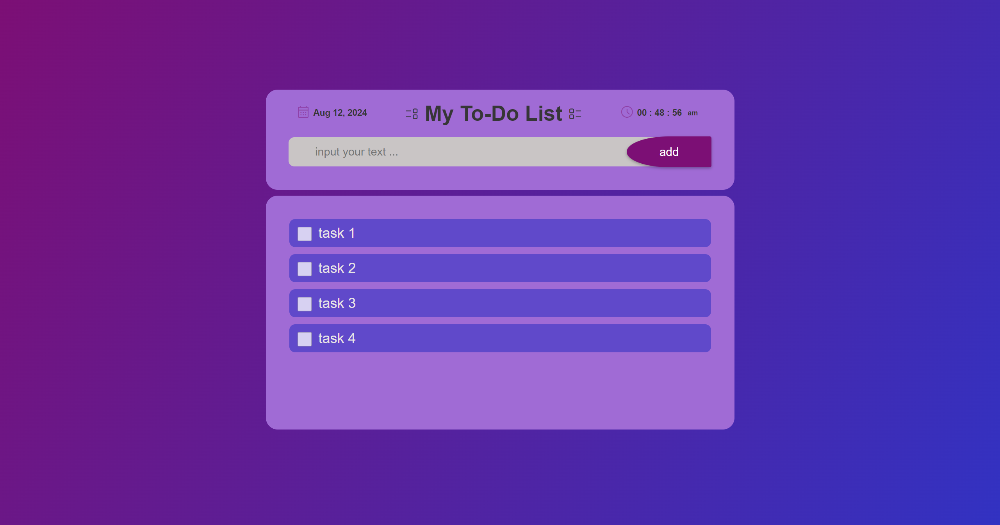

# 🗒️ **To-Do List App**

## 📋 **Description**

This To-Do List application is built using JavaScript and CSS. It provides a simple and efficient way to manage and keep track of your tasks.

## 🌐 **Live Demo**

Check out the live version of this app:

[**To-Do List App**](https://p-limbo1996.github.io/to-do-list-js/)

## 🖼️ **Screenshot**

Here is a screenshot of the app:



## ⚙️ **Usage**

To set up and run the app locally:

1. **Clone the repository:**

   ```bash
   git clone https://github.com/username/todo-list-app.git
   
   Navigate to the project directory:
   ```cd todo-list-app```
   Open the app: Simply open index.html in your web browser

   ##🌟 Features
✅ Add, edit, and delete to-do items
🗂️ Mark items as completed
📱 Responsive design using CSS
💾 Local storage support for persistence
